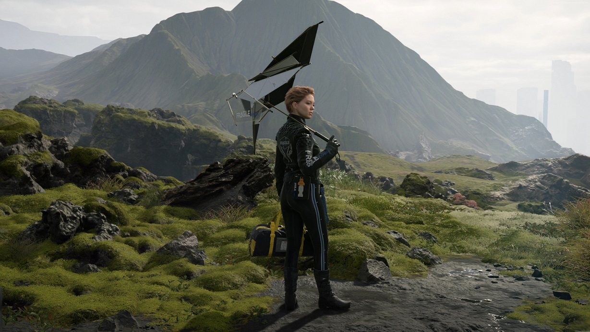

## Death Stranding Landing Page


[🚀 Live Preview](https://death-stranding-game.netlify.app/)

A modern, fully responsive **static landing page** inspired by the *Death Stranding* promotional websites.
This project showcases a clean and adaptive layout built with **HTML5** and **CSS3**, optimized for **mobile, tablet, and desktop** screens.

---

## 🌟 Features

* **Fully responsive layout** (Mobile, Tablet & Desktop)
* **Hero section** with background image and CTA buttons
* **Video preview tile**
* **Testimonials grid**
* **Pricing cards**
* **FAQ accordion layout**
* **Footer with subscription form**
* Built using **plain HTML + CSS** (no frameworks)

---

## 🧭 How to Preview Locally

1. Open `index.html` directly in your browser
   *(Right-click → Open with → Your Browser)*
2. Or serve the folder locally with a lightweight static server:

   ```bash
   # Using Python 3
   python -m http.server 8000
   ```

   Then open [http://localhost:8000](http://localhost:8000)

---

## 🖼️ Preview Gallery




---

## 🧩 Credits

* **Icons:** [Font Awesome (CDN)](https://fontawesome.com)
* **Design Inspiration:** *Death Stranding* promotional material

---

> ⚡️ **Update:**
> The project layout is now **responsive** — optimized for **phones, tablets, and large screens** using CSS media queries.
